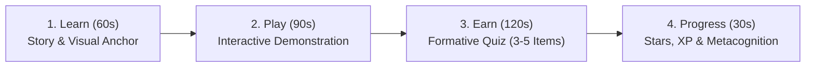

# Formal Curriculum Specification: Learning With Fun (Grade 2 MVP1)

**Document**: Grade 2 Maths & Science Curriculum Blueprint  
**Target Learners**: Grade 2 (Ages 6–8) and early learners  
**Pedagogical Framework**: The 4-Stage Micro-Learning Loop (Learn → Play → Earn → Progress)  
**Total Lessons**: 50 Micro-Lessons (25 Mathematics, 25 Science)  
**Document Version**: 1.0  
**Status**: Approved Specification  

---

## 1. Pedagogical Framework & Micro-Learning Architecture

Each lesson is engineered to fit a child's natural attention window ($3\text{ to }7\text{ minutes}$) while ensuring cognitive transfer from concept introduction to independent mastery.

### 1.1 The 4 Lesson Stages
1. **Learn (Conceptual Storytelling)**:
   - Concise, conversational narrative using simple Grade 2 vocabulary.
   - Grounded in everyday physical objects (e.g., apples, building blocks, leaves, animals).
   - Visual anchor image or diagram on screen.
2. **Play (Guided Demonstration)**:
   - Interactive or guided example walking step-by-step through the concept.
   - Highlights the "why" and "how" (e.g., grouping two groups of 5 into a 10-bundle).
3. **Earn (Formative Challenges)**:
   - 3 to 5 questions with increasing cognitive challenge (Easy $\to$ Medium $\to$ Hard).
   - Immediate audio-visual feedback: Green glow for correct; soft bounce and supportive hint for incorrect.
4. **Progress (Celebration & Summary)**:
   - Summary of key takeaway (e.g., *"You learned that a triangle has 3 sides!"*).
   - Star burst animation (1–3 stars) and XP addition.

---

## 2. Complete Mathematics Curriculum (25 Lessons)

### Module 1: Numbers & Place Value (5 Lessons)
*Theme: Journey into Number Land*

| Lesson ID | Lesson Title | Learning Objective | Key Vocabulary | Sample Challenge Question |
|:---|:---|:---|:---|:---|
| `maths-m1-l1` | **Counting 1 to 10** | Count distinct objects up to 10 with 1-to-1 correspondence. | Count, Number, Total | Count the stars: ⭐⭐⭐⭐⭐. How many?  *(Options: 3, 4, **5**, 6)* |
| `maths-m1-l2` | **Counting 11 to 20** | Recognize and sequence teen numbers from 11 through 20. | Eleven to Twenty, Sequence | Which number comes right after 14?  *(Options: 13, **15**, 16, 17)* |
| `maths-m1-l3` | **Place Value: Tens & Ones** | Decompose 2-digit numbers into groups of tens and remaining ones. | Tens, Ones, Place Value | In the number **34**, how many tens are there?  *(Options: 4, **3**, 7, 30)* |
| `maths-m1-l4` | **Comparing Numbers** | Compare two quantities up to 100 using `>`, `<`, and `=`. | Greater than, Less than, Equal | Choose the correct symbol: **18 [ ? ] 12**  *(Options: `<`, **`>`**, `=`)* |
| `maths-m1-l5` | **Number Patterns & Skip Counting** | Recognize and extend patterns counting by 2s, 5s, and 10s. | Pattern, Skip count, Next | Complete the pattern: **5, 10, 15, [ ? ]**  *(Options: 16, 18, **20**, 25)* |

---

### Module 2: Addition (5 Lessons)
*Theme: The Magic Plus Factory*

| Lesson ID | Lesson Title | Learning Objective | Key Vocabulary | Sample Challenge Question |
|:---|:---|:---|:---|:---|
| `maths-m2-l1` | **Adding within 10** | Fluently combine two sets of objects with sums up to 10. | Add, Plus, Sum, Equal | Leo has 4 red cars and 3 blue cars. How many in total?  *(Options: 6, **7**, 8, 9)* |
| `maths-m2-l2` | **Adding within 20: Make a Ten** | Use the "Make a Ten" mental strategy to add within 20. | Make a ten, Friendly number | What is **8 + 5**? *(Think: 8 + 2 = 10, then + 3)*  *(Options: 12, **13**, 14, 15)* |
| `maths-m2-l3` | **Adding Doubles** | Memorize and apply doubles facts from $1+1$ up to $10+10$. | Doubles, Pair, Twice | What is double **6** ($6 + 6$)?  *(Options: 10, 11, **12**, 14)* |
| `maths-m2-l4` | **Adding Three Numbers** | Group any two numbers first to add three single-digit numbers. | Group, Parentheses, Order | Solve: **3 + 4 + 3 = ?**  *(Options: 9, **10**, 11, 12)* |
| `maths-m2-l5` | **Addition Story Problems** | Translate real-world story scenarios into addition number sentences. | In all, Altogether, Joined | Mia picked 7 flowers. Sam gave her 6 more. How many flowers does Mia have now?  *(Options: 11, 12, **13**, 14)* |

---

### Module 3: Subtraction (5 Lessons)
*Theme: The Take-Away Treasure Hunt*

| Lesson ID | Lesson Title | Learning Objective | Key Vocabulary | Sample Challenge Question |
|:---|:---|:---|:---|:---|
| `maths-m3-l1` | **Subtracting within 10** | Deduce the remaining quantity after taking items away. | Subtract, Minus, Left over | There were 9 birds on a branch. 4 flew away. How many remain?  *(Options: 4, **5**, 6, 7)* |
| `maths-m3-l2` | **Subtracting within 20** | Count back on a number line to subtract from teen numbers. | Count back, Difference | What is **15 - 7 = ?**  *(Options: 7, **8**, 9, 10)* |
| `maths-m3-l3` | **Subtracting Doubles** | Relate doubles addition to subtraction ($14 - 7 = 7$). | Half, Related facts | If $8 + 8 = 16$, what is **16 - 8**?  *(Options: 6, 7, **8**, 9)* |
| `maths-m3-l4` | **Missing Subtrahends** | Find unknown quantities in equations ($10 - \square = 6$). | Missing part, Unknown | What number fits the box: **9 - [ ? ] = 4**  *(Options: 3, 4, **5**, 6)* |
| `maths-m3-l5` | **Subtraction Story Problems** | Solve contextual multi-step comparison and change word problems. | Fewer, How many more, Left | Noah baked 12 cookies. His brother ate 5. How many cookies are left?  *(Options: 6, **7**, 8, 9)* |

---

### Module 4: Shapes & Geometry (5 Lessons)
*Theme: The Shape Builder Academy*

| Lesson ID | Lesson Title | Learning Objective | Key Vocabulary | Sample Challenge Question |
|:---|:---|:---|:---|:---|
| `maths-m4-l1` | **2D Shapes: Circle, Square, Triangle** | Identify, name, and distinguish primary 2-dimensional shapes. | 2D, Flat, Circle, Triangle, Square | Which shape has exactly 3 straight sides?  *(Options: Circle, Square, **Triangle**, Oval)* |
| `maths-m4-l2` | **3D Shapes: Sphere, Cube, Cylinder** | Identify common solid 3D geometric solids in the real world. | 3D, Solid, Sphere, Cube, Cylinder | What 3D shape looks like a soda can?  *(Options: Cube, **Cylinder**, Sphere, Cone)* |
| `maths-m4-l3` | **Shape Attributes: Sides & Corners** | Count vertices (corners) and straight edges (sides) of polygons. | Vertices, Corners, Edges, Sides | How many corners does a rectangle have?  *(Options: 3, **4**, 5, 6)* |
| `maths-m4-l4` | **Sorting Shapes by Attributes** | Classify shapes by color, number of sides, or curved vs flat surfaces. | Sort, Category, Property | Which of these shapes does NOT have any straight sides?  *(Options: Square, Triangle, **Circle**, Hexagon)* |
| `maths-m4-l5` | **Geometric Shape Patterns** | Identify the core unit of repeating and expanding shape patterns. | Repeating unit, Pattern rule | Pattern: 🔴 🟦 🔴 🟦 [ ? ]. What comes next?  *(Options: 🟦, **🔴**, 🔺, 🟩)* |

---

### Module 5: Measurement & Time (5 Lessons)
*Theme: The Little Time Traveler & Builder*

| Lesson ID | Lesson Title | Learning Objective | Key Vocabulary | Sample Challenge Question |
|:---|:---|:---|:---|:---|
| `maths-m5-l1` | **Measuring with Non-Standard Units** | Measure object length using iterative uniform objects (paperclips/blocks). | Length, Non-standard unit, Longest | If a pencil is 6 paperclips long and an eraser is 2, which is longer?  *(Options: Eraser, **Pencil**, Both same)* |
| `maths-m5-l2` | **Standard Units: Centimetres** | Use a standard ruler starting at 0 to measure length in cm. | Centimetre (cm), Ruler, Measure | Where should you align the edge of an object on a ruler?  *(Options: At 1, **At 0**, At 10, Anywhere)* |
| `maths-m5-l3` | **Weight: Heavy vs. Light** | Compare the mass of two objects using a balance scale. | Heavier, Lighter, Balance scale | When using a balance scale, which side goes DOWN?  *(Options: **The heavier side**, The lighter side)* |
| `maths-m5-l4` | **Time: Hours on the Clock** | Read time to the exact hour on an analog clock ($1:00$ to $12:00$). | Hour hand, Minute hand, O'clock | When the short hand is on 4 and the long hand is on 12, what time is it?  *(Options: 12:04, **4:00**, 4:12, 12:00)* |
| `maths-m5-l5` | **Time: Half-Hours (Half Past)** | Read and write time to the half-hour (e.g., $4:30$). | Half past, 30 minutes | Where does the long minute hand point when it is "half past"?  *(Options: At 12, At 3, **At 6**, At 9)* |

---

## 3. Complete Science Curriculum (25 Lessons)

### Module 1: Living & Non-Living Things (5 Lessons)
*Theme: Nature Explorers*

| Lesson ID | Lesson Title | Learning Objective | Key Vocabulary | Sample Challenge Question |
|:---|:---|:---|:---|:---|
| `science-s1-l1` | **What is Alive?** | Differentiate living things from non-living things by growth and breath. | Living, Non-living, Grow, Breathe | Which of the following is a living thing?  *(Options: Rock, Toy car, **Puppy**, Plastic cup)* |
| `science-s1-l2` | **Characteristics of Life** | Understand that living things need energy (food/water) and reproduce. | Energy, Nutrition, Offspring | What do all living things need to survive and stay healthy?  *(Options: Toys, **Water and food**, Cell phones)* |
| `science-s1-l3` | **Exploring Living Organisms** | Discover variety among living organisms: animals, trees, insects, fungi. | Organism, Diversity, Creature | True or False: Trees and grass are alive just like animals!  *(Options: **True 👍**, False 👎)* |
| `science-s1-l4` | **Exploring Non-Living Objects** | Recognize natural (rocks, clouds) vs. man-made (bicycles, books) non-living items. | Man-made, Natural object | A cloud moves across the sky. Is a cloud alive?  *(Options: Yes, **No - it cannot eat or grow**)* |
| `science-s1-l5` | **Sorting Living vs. Non-Living** | Categorize mixed items into living and non-living bins. | Classification, Evidence | Which item belongs in the "Non-Living" bin?  *(Options: Earthworm, Rose bush, **Metal spoon**, Goldfish)* |

---

### Module 2: Plants (5 Lessons)
*Theme: The Botanical Garden*

| Lesson ID | Lesson Title | Learning Objective | Key Vocabulary | Sample Challenge Question |
|:---|:---|:---|:---|:---|
| `science-s2-l1` | **Parts of a Plant** | Identify roots, stem, leaves, and flowers, and state their roles. | Roots, Stem, Leaves, Flower | Which part of the plant anchors it into the ground and drinks water?  *(Options: Leaves, Flower, **Roots**, Stem)* |
| `science-s2-l2` | **What Plants Need to Grow** | Identify sunlight, water, soil, and air as essential plant needs. | Sunlight, Soil, Air, Nutrients | What happens to a green plant if kept in a dark closet for weeks?  *(Options: Grows huge, **Turns yellow and weak**, Blooms flowers)* |
| `science-s2-l3` | **How Plants Grow: Life Cycle** | Sequence seed $\to$ sprout $\to$ seedling $\to$ mature flowering plant. | Life cycle, Seed, Sprout, Seedling | What is the very first stage in the life of a sunflower?  *(Options: Tall flower, **Tiny seed**, Ripe fruit)* |
| `science-s2-l4` | **Types of Plants** | Contrast tall trees (woody trunks) with bushes, grasses, and climbers. | Trunk, Bark, Shrub, Vine | Which plant has a hard, woody stem called a trunk?  *(Options: Dandelion, Grass, **Oak Tree**, Clover)* |
| `science-s2-l5` | **Plants and Us** | Appreciate human reliance on plants for oxygen, fruits, vegetables, and shelter. | Oxygen, Food, Medicine, Timber | What invisible gas do green plants give out that humans breathe in?  *(Options: Smoke, **Oxygen**, Steam)* |

---

### Module 3: Animals (5 Lessons)
*Theme: The Animal Safari*

| Lesson ID | Lesson Title | Learning Objective | Key Vocabulary | Sample Challenge Question |
|:---|:---|:---|:---|:---|
| `science-s3-l1` | **Animal Groups: Mammals, Birds, Fish** | Group animals by bodily features (fur/milk, feathers, scales/fins). | Mammal, Bird, Fish, Feathers | Which animal group has fur or hair and feeds their babies with milk?  *(Options: Birds, Reptiles, **Mammals**, Fish)* |
| `science-s3-l2` | **Animal Habitats** | Match animals to their natural homes (ocean, desert, forest, arctic). | Habitat, Shelter, Climate | Where is the natural habitat of a clownfish?  *(Options: Desert, Forest canopy, **Coral reef in ocean**)* |
| `science-s3-l3` | **What Animals Eat** | Categorize animals into herbivores (plants), carnivores (meat), and omnivores. | Herbivore, Carnivore, Omnivore | A rabbit eats carrots, grass, and leaves. What kind of eater is it?  *(Options: Carnivore, **Herbivore**, Omnivore)* |
| `science-s3-l4` | **Animal Life Cycles: Frog & Butterfly** | Describe metamorphosis from egg $\to$ caterpillar $\to$ chrysalis $\to$ butterfly. | Metamorphosis, Tadpole, Caterpillar | What does a frog hatch from an egg as?  *(Options: Butterfly, **Tadpole**, Adult frog)* |
| `science-s3-l5` | **Animal Adaptations** | Discover how special physical traits help animals survive in their habitats. | Adaptation, Camouflage, Claws | Why do polar bears have thick white fur?  *(Options: To swim faster, **To stay warm and hide in the snow**)* |

---

### Module 4: Human Body & Senses (5 Lessons)
*Theme: The Super Human Detective*

| Lesson ID | Lesson Title | Learning Objective | Key Vocabulary | Sample Challenge Question |
|:---|:---|:---|:---|:---|
| `science-s4-l1` | **Our Amazing Body Parts** | Locate external body parts and understand joints (knees, elbows) for movement. | Head, Limbs, Joints, Bones | Which joint helps your leg bend so you can run and jump?  *(Options: Elbow, Wrist, **Knee**, Shoulder)* |
| `science-s4-l2` | **The Five Senses Overview** | Map the 5 senses (Sight, Hearing, Smell, Taste, Touch) to sensory organs. | Senses, Sight, Hearing, Touch | Which organ do we use to taste sweet honey and sour lemons?  *(Options: Nose, Ears, **Tongue**, Skin)* |
| `science-s4-l3` | **The Sense of Sight** | Understand how our eyes receive light to see colors, shapes, and motion. | Eyes, Light, Darkness, Pupil | What do our eyes need to be able to see clearly?  *(Options: Total darkness, **Light**, Loud sounds)* |
| `science-s4-l4` | **The Sense of Hearing** | Understand how ears detect vibrations as soft/loud and high/low sounds. | Ears, Sound, Volume, High pitch | Which sound is soft and quiet?  *(Options: Fire siren, Thunder, **Kitten purring**, Jet plane)* |
| `science-s4-l5` | **Senses of Touch, Taste & Smell** | Explore skin receptors for hot/cold/smooth and how smell & taste work together. | Texture, Temperature, Flavor | Which sense warns you immediately if a cup of cocoa is too hot to touch?  *(Options: Hearing, **Touch**, Sight)* |

---

### Module 5: Materials & Matter (5 Lessons)
*Theme: The Matter & Materials Workshop*

| Lesson ID | Lesson Title | Learning Objective | Key Vocabulary | Sample Challenge Question |
|:---|:---|:---|:---|:---|
| `science-s5-l1` | **What is Matter?** | Learn that everything around us is matter: it takes up space and has mass. | Matter, Mass, Space | Does air take up space inside a blown-up balloon?  *(Options: **Yes - air is matter!**, No - air is nothing)* |
| `science-s5-l2` | **States of Matter: Solid, Liquid, Gas** | Classify substances into Solids (holds shape), Liquids (flows), and Gases. | Solid, Liquid, Gas | Which state of matter flows and takes the shape of its container?  *(Options: Solid rock, **Liquid water**, Wooden block)* |
| `science-s5-l3` | **Changing States: Melting & Freezing** | Understand that temperature changes state (ice melts $\to$ water freezes). | Melt, Freeze, Heat, Temperature | What happens to an ice cube when it is left in the warm sunshine?  *(Options: It freezes solid, **It melts into liquid water**)* |
| `science-s5-l4` | **Mixing Materials** | Observe results when combining materials (sugar dissolves in water, sand sinks). | Mix, Dissolve, Separate | What happens when you stir a spoonful of sugar into warm water?  *(Options: It turns into stone, **It dissolves and disappears**)* |
| `science-s5-l5` | **Everyday Materials & Their Properties** | Identify why materials are chosen for objects (glass for windows, metal for spoons). | Wood, Metal, Glass, Flexible, Waterproof | Why are windows made of glass instead of wood?  *(Options: Glass is soft, **Glass is clear and lets light in**)* |

---

## 4. Question Design Standards for Early Learners

1. **Cognitive Load & Reading Accessibility**:
   - Question prompts must not exceed **18 words**.
   - Use direct, active voice ("Count the dots", "Which animal is a mammal?").
   - Highlight key operators in bold (`NOT`, `LIVING`, `GREATER`).
2. **Kid-Friendly Distractor Engineering**:
   - Distractors must address real developmental mistakes (e.g. adding when subtracted, mistaking an oval for a circle).
   - Never use trick questions, negative trick phrasing ("Which is NOT not..."), or punitive traps.
3. **Growth Mindset Feedback**:
   - Every question includes an encouraging, instructive feedback note shown when answered:
     - *Correct*: `"Super job! A triangle always has 3 straight sides."`
     - *Retry*: `"Almost there! Let's count the sides together: 1, 2, 3!"`
