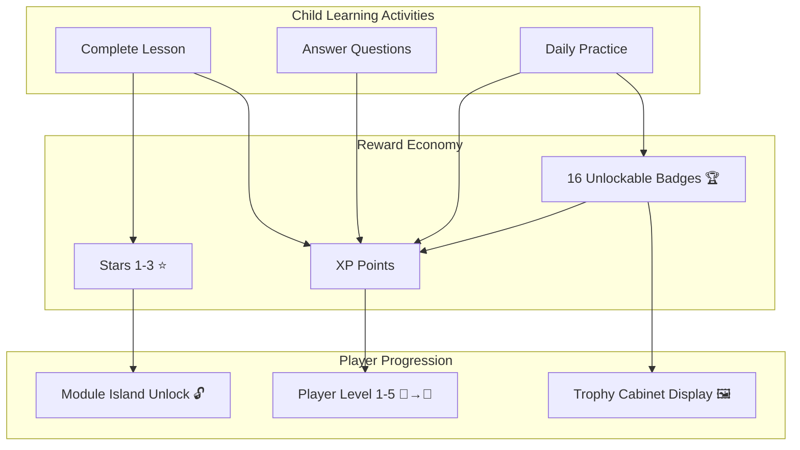
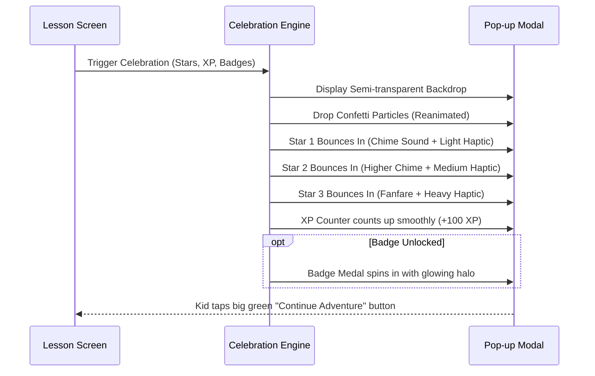

# Gamification, Progression Levels & Badges Specification (MVP1)

**Document**: Gamification Engine & Rewards System Specification  
**Target Learners**: Grade 2 Kids (Ages 4–8)  
**Core Purpose**: Foster intrinsic motivation, celebrate small wins, encourage learning habits, and reward effort without punitive mechanisms.  
**Document Version**: 1.0  
**Status**: Approved Specification  

---

## 1. Gamification Philosophy for Early Childhood

For kids up to Grade 2, gamification must differ fundamentally from adult or adolescent gaming:
1. **Never Punitive**: Children at this age get easily discouraged by harsh buzzers, red penalty scores, or loss of lives. All feedback is constructive and growth-oriented.
2. **Immediate Gratification**: Young children have short temporal horizons; rewards (stars, XP, badges) are granted immediately upon completing an action.
3. **Visual & Tactile Dominance**: Bubbly animations, bouncing stars, confetti particle bursts, and haptic pulses drive excitement far more than abstract numerical ranks.
4. **Effort Over Perfection**: Participating, retrying, and demonstrating curiosity earns meaningful XP, ensuring every child feels capable of leveling up.

---

## 2. The Reward Economy & Mechanics

The economy consists of three complementary layers: **XP (Experience Points)**, **Stars (Mastery Badges)**, and **Achievement Badges**.



---

## 3. XP (Experience Points) Economy

XP tracks a child’s cumulative learning journey across all modules.

### 3.1 XP Earning Matrix
| Activity / Event | XP Awarded | Description |
|:---|:---:|:---|
| **Lesson Passed with High Mastery ($\ge 90\%$)** | `+100 XP` | Perfect or near-perfect understanding (3 Stars). |
| **Lesson Passed with Proficiency ($70\% - 89\%$)** | `+75 XP` | Solid conceptual grasp (2 Stars). |
| **Lesson Passed with Foundation ($50\% - 69\%$)** | `+50 XP` | Basic understanding achieved (1 Star). |
| **Lesson Attempted (Score $< 50\%$)** | `+25 XP` | Participation & effort reward with encouragement to retry. |
| **First-Time Completion Bonus** | `+20% Bonus` | Extra multiplier on the base XP earned for the first run. |
| **Lesson Replay Improvement** | Difference in XP | Replaying and achieving a higher score awards the point difference. |
| **Badge Unlock Bonus** | `+50 XP` to `+150 XP` | Bonus XP awarded when any of the 16 badges is unlocked. |
| **Daily Streak Bonus** | `+20 XP` | Bonus for logging in and completing at least 1 lesson per day. |

---

## 4. Star Rating System (0 to 3 Stars)

Every lesson awards between 1 and 3 stars based on the final challenge quiz score.

```
┌────────────────────────────────────────────────────────────────────────┐
│                        STAR RATING THRESHOLDS                          │
├─────────┬──────────────┬─────────────┬─────────────────────────────────┤
│ Stars   │ Score Range  │ Performance │ Feedback Message                │
├─────────┼──────────────┼─────────────┼─────────────────────────────────┤
│ ⭐⭐⭐   │ 90% – 100%   │ Outstanding │ "Incredible! You are a Genius!" │
│ ⭐⭐     │ 70% – 89%    │ Great Job   │ "Awesome work! Almost perfect!" │
│ ⭐       │ 50% – 69%    │ Good Effort │ "Good job! You passed the quest!"│
│ 0 Stars │ 0% – 49%     │ Keep Trying │ "Nice try! Let's practice again!"│
└─────────┴──────────────┴─────────────┴─────────────────────────────────┘
```

- **Maximum Star Bank**: 50 lessons $\times$ 3 stars = **150 Total Stars** available in MVP1.
- **Star Bank Functionality**: Accumulated stars act as "keys" to unlock new learning islands and modules.

---

## 5. 5-Tier Level Progression System

As the child accumulates XP, their overall title and level icon upgrade dynamically.

### 5.1 Level Progression Table

| Level | Title | Badge Icon | XP Range | Total Stars Needed | Description & Unlocked Status |
|:---:|:---|:---:|:---:|:---:|:---|
| **1** | **Curious Seedling** | 🌱 | 0 – 200 XP | 0 Stars | Starting level. Modules M1 and S1 are open. |
| **2** | **Junior Explorer** | 🔍 | 201 – 600 XP | 10 Stars | Explored first concepts; unlocks M2 & S2. |
| **3** | **Knowledge Adventurer** | 🚀 | 601 – 1,200 XP | 25 Stars | Mid-point learner; unlocks M3 & S3. |
| **4** | **Math & Science Star** | ⭐ | 1,201 – 2,000 XP | 45 Stars | High achiever; unlocks M4 & S4. |
| **5** | **Grand Master Whiz** | 👑 | 2,001+ XP | 70 Stars | Highest MVP1 honor; unlocks capstone M5 & S5. |

### 5.2 Dynamic Progress Bar Formula
Within any given level, the UI renders a vibrant filling bar:

$$\text{Fill Percentage} = \min\left(100, \max\left(0, \frac{\text{CurrentXP} - \text{LevelMinXP}}{\text{LevelMaxXP} - \text{LevelMinXP}} \times 100\right)\right)$$

When the bar hits 100%, the **Level Up Celebration Screen** triggers immediately with fanfare audio, floating balloons, and title promotion.

---

## 6. Module Island Gating & Unlock Thresholds

To give kids a clear sense of adventure, lessons are laid out along an island trail. Modules unlock as children earn stars across both subjects:

```
┌────────────────────────────────────────────────────────────────────────┐
│                        MODULE UNLOCK SCHEDULE                          │
├─────────┬───────────────────────────────┬──────────────┬───────────────┤
│ Subject │ Module Name                   │ Order        │ Stars Needed  │
├─────────┼───────────────────────────────┼──────────────┼───────────────┤
│ Maths   │ M1: Numbers & Place Value     │ Module 1     │ 0 (Unlocked)  │
│ Science │ S1: Living & Non-Living       │ Module 1     │ 0 (Unlocked)  │
│ Maths   │ M2: Addition                  │ Module 2     │ 6 Stars       │
│ Science │ S2: Plants                    │ Module 2     │ 14 Stars      │
│ Maths   │ M3: Subtraction               │ Module 3     │ 24 Stars      │
│ Science │ S3: Animals                   │ Module 3     │ 36 Stars      │
│ Maths   │ M4: Shapes & Geometry         │ Module 4     │ 48 Stars      │
│ Science │ S4: Human Body & Senses       │ Module 4     │ 60 Stars      │
│ Maths   │ M5: Measurement & Time        │ Module 5     │ 74 Stars      │
│ Science │ S5: Materials & Matter        │ Module 5     │ 90 Stars      │
└─────────┴───────────────────────────────┴──────────────┴───────────────┘
```

*Note: If a child attempts to tap a locked module, a friendly pop-up displays: "Earn 4 more stars to unlock this adventure island! ⭐"*

---

## 7. The 16 Badges Catalog Specification

Badges are stored in the child's **Trophy Cabinet (`app/badges/index.tsx`)**. Locked badges appear as mysterious, sparkling silhouetted medals with a tooltip hinting at how to earn them.

```
┌──────────────────────────────────────────────────────────────────────────────┐
│                            THE 16 MVP1 BADGES                                │
├─────┬──────────────────┬───────────┬──────────────┬──────────────────────────┤
│ No. │ Badge Name       │ Category  │ XP Bonus     │ Unlock Trigger Condition │
├─────┼──────────────────┼───────────┼──────────────┼──────────────────────────┤
│ 1   │ First Adventure  │ Milestone │ +50 XP       │ Complete 1st lesson      │
│ 2   │ Number Novice    │ Maths     │ +75 XP       │ Complete all M1 lessons  │
│ 3   │ Nature Scout     │ Science   │ +75 XP       │ Complete all S1 lessons  │
│ 4   │ Bullseye!        │ Mastery   │ +100 XP      │ Score 100% on any lesson │
│ 5   │ Star Collector   │ Progress  │ +100 XP      │ Collect 25 total stars   │
│ 6   │ Superstar!       │ Progress  │ +150 XP      │ Collect 60 total stars   │
│ 7   │ Addition Ace     │ Maths     │ +75 XP       │ Complete all M2 lessons  │
│ 8   │ Minus Magician   │ Maths     │ +75 XP       │ Complete all M3 lessons  │
│ 9   │ Shape Detective  │ Maths     │ +75 XP       │ Complete all M4 lessons  │
│ 10  │ Time Keeper      │ Maths     │ +75 XP       │ Complete all M5 lessons  │
│ 11  │ Green Thumb      │ Science   │ +75 XP       │ Complete all S2 lessons  │
│ 12  │ Animal Kingdom   │ Science   │ +75 XP       │ Complete all S3 lessons  │
│ 13  │ Super Senses     │ Science   │ +75 XP       │ Complete all S4 lessons  │
│ 14  │ Little Chemist   │ Science   │ +75 XP       │ Complete all S5 lessons  │
│ 15  │ Super Streak     │ Habit     │ +100 XP      │ Learn 3 days in a row    │
│ 16  │ Grand Master     │ Capstone  │ +200 XP      │ Reach Level 5 Whiz       │
└─────┴──────────────────┴───────────┴──────────────┴──────────────────────────┘
```

### 7.1 Detailed Badge Specifications

#### Badge 1: First Adventure 🎒
- **Category**: Milestone
- **Visual Motif**: A golden compass with vibrant cyan border.
- **Criteria**: `userProgress.filter(p => p.completed).length >= 1`
- **Popup Headline**: *"Your Learning Adventure Begins!"*
- **Description**: Awarded for completing your very first lesson.

#### Badge 2: Number Novice 🔢
- **Category**: Subject (Maths)
- **Visual Motif**: Number blocks 1-2-3 stacked on a cloud.
- **Criteria**: All 5 lessons of `maths-m1` completed.
- **Popup Headline**: *"Master of Numbers!"*
- **Description**: Completed all Numbers & Place Value lessons.

#### Badge 3: Nature Scout 🌿
- **Category**: Subject (Science)
- **Visual Motif**: A green magnifying glass over a leaf.
- **Criteria**: All 5 lessons of `science-s1` completed.
- **Popup Headline**: *"Living World Explorer!"*
- **Description**: Discovered what makes things living and non-living.

#### Badge 4: Bullseye! 🎯
- **Category**: Mastery
- **Visual Motif**: A target with a gold arrow in the center.
- **Criteria**: Any lesson where `score === 100`.
- **Popup Headline**: *"100% Perfect Score!"*
- **Description**: Answered every single challenge question correctly.

#### Badge 5: Star Collector ⭐
- **Category**: Collection
- **Visual Motif**: A pouch full of sparkling stars.
- **Criteria**: `totalStarsEarned >= 25`.
- **Popup Headline**: *"You Collected 25 Stars!"*
- **Description**: Reached 25 glowing stars across your lessons.

#### Badge 6: Superstar! 🌟
- **Category**: Collection
- **Visual Motif**: A giant radiant gold star with a crown.
- **Criteria**: `totalStarsEarned >= 60`.
- **Popup Headline**: *"60 Stars! You Shine Bright!"*
- **Description**: Earned 60 stars across Maths and Science.

#### Badge 7: Addition Ace ➕
- **Category**: Subject (Maths)
- **Visual Motif**: A shiny plus symbol surrounded by sparks.
- **Criteria**: All 5 lessons of `maths-m2` completed.
- **Popup Headline**: *"Addition Master!"*
- **Description**: Conquered all addition and "Make a Ten" lessons.

#### Badge 8: Minus Magician ➖
- **Category**: Subject (Maths)
- **Visual Motif**: A magic wand taking away stars.
- **Criteria**: All 5 lessons of `maths-m3` completed.
- **Popup Headline**: *"Subtraction Wizardry!"*
- **Description**: Successfully solved all subtraction challenges.

#### Badge 9: Shape Detective 📐
- **Category**: Subject (Maths)
- **Visual Motif**: A puzzle box with circle, square, and triangle cutouts.
- **Criteria**: All 5 lessons of `maths-m4` completed.
- **Popup Headline**: *"Shape Detective Extraordinaire!"*
- **Description**: Identified and sorted all 2D and 3D shapes.

#### Badge 10: Time Keeper ⏰
- **Category**: Subject (Maths)
- **Visual Motif**: A smiling analog clock pointing to 12:00.
- **Criteria**: All 5 lessons of `maths-m5` completed.
- **Popup Headline**: *"Master of the Clock!"*
- **Description**: Learned to tell hours, half-hours, and measure things.

#### Badge 11: Green Thumb 🌻
- **Category**: Subject (Science)
- **Visual Motif**: A watering can watering a sunflower seedling.
- **Criteria**: All 5 lessons of `science-s2` completed.
- **Popup Headline**: *"Plant Kingdom Hero!"*
- **Description**: Discovered parts of plants and how seeds grow.

#### Badge 12: Animal Kingdom 🦁
- **Category**: Subject (Science)
- **Visual Motif**: A lion cub wearing a small safari hat.
- **Criteria**: All 5 lessons of `science-s3` completed.
- **Popup Headline**: *"Wildlife Ranger!"*
- **Description**: Learned all about mammals, birds, fish, and habitats.

#### Badge 13: Super Senses 👁️👂
- **Category**: Subject (Science)
- **Visual Motif**: A superhero mask with radiating sensory waves.
- **Criteria**: All 5 lessons of `science-s4` completed.
- **Popup Headline**: *"The 5 Senses Superhero!"*
- **Description**: Mastered sight, hearing, touch, taste, and smell.

#### Badge 14: Little Chemist 🧪
- **Category**: Subject (Science)
- **Visual Motif**: A laboratory flask with bubbly purple liquid.
- **Criteria**: All 5 lessons of `science-s5` completed.
- **Popup Headline**: *"Master of Matter!"*
- **Description**: Discovered solids, liquids, gases, and melting ice.

#### Badge 15: Super Streak 🔥
- **Category**: Habit / Consistency
- **Visual Motif**: A flame with a "3 Days" ribbon.
- **Criteria**: `currentStreakDays >= 3`.
- **Popup Headline**: *"3-Day Learning Streak!"*
- **Description**: Completed learning adventures 3 days in a row!

#### Badge 16: Grand Master 👑
- **Category**: Capstone
- **Visual Motif**: A diamond-encrusted royal crown on a velvet pillow.
- **Criteria**: Player reaches **Level 5 (Grand Master Whiz)**.
- **Popup Headline**: *"All-Star Grand Master Whiz!"*
- **Description**: Attained the highest rank in Learning With Fun MVP1!

---

## 8. Streak Engine & Forgiveness Logic

1. **Daily Practice Check**:
   - The app records the user's `lastActiveDate` formatted as `YYYY-MM-DD`.
   - When a lesson is completed on a new calendar day:
     - If $\text{Date} - \text{lastActiveDate} = 1\text{ day}$: $\text{streakDays} = \text{streakDays} + 1$.
     - If $\text{Date} - \text{lastActiveDate} = 0\text{ days}$: streak is maintained.
     - If $\text{Date} - \text{lastActiveDate} > 1\text{ day}$:
       - **Forgiveness Grace**: The first missed day does NOT reset the streak immediately; it displays a friendly *"Saved your streak! Practice today to keep it burning! 🔥"* prompt.
       - If $\ge 2\text{ days}$ pass without activity, streak resets to 1 without punitive messaging.

---

## 9. Celebration UI & Audio-Visual Effects

When a child finishes a lesson or unlocks a badge, the **Celebration Engine** triggers:



### Sensory Feedback Specifications:
- **Button Tap**: Light haptic impact (`Haptics.impactAsync(ImpactFeedbackStyle.Light)`).
- **Correct Selection**: High cheerful bell tone (`ding.mp3`).
- **Gentle Miss**: Soft wooden block knock (`pop.mp3`).
- **Star Bounce**: High-register harp pluck per star.
- **Badge Unlocked**: Royal fanfare brass blast (`tada.mp3`).
