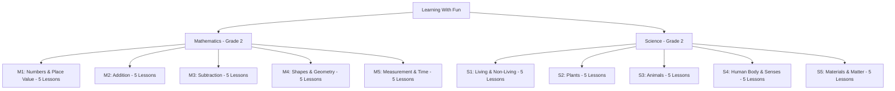
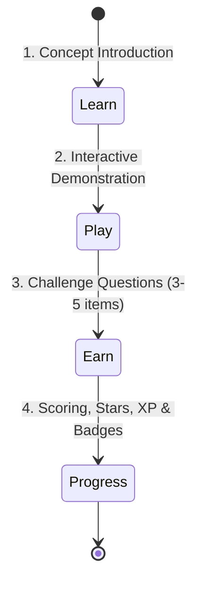
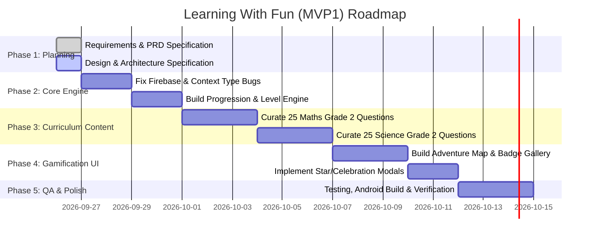

# Project Planning Document: Learning With Fun (MVP1)

**Project Name**: Learning With Fun  
**Target Platform**: Mobile (Android-first, iOS ready)  
**Framework**: React Native with Expo SDK 51, TypeScript, Expo Router  
**Target Audience**: Children up to Grade 2 (Ages 4–8) and their Parents  
**Document Version**: 1.0  
**Status**: Approved for Implementation  

---

## 1. Executive Summary & Vision

### 1.1 Vision
**Learning With Fun** is designed to transform early childhood education into an exciting, self-motivated adventure. Rather than rote memorization or dry digital worksheets, the app engages young minds through vibrant visuals, playful micro-lessons, interactive tactile challenges, and positive reinforcement.

### 1.2 MVP1 Objective
The primary objective of **MVP1 (Minimum Viable Product 1)** is to deliver a functional, delightful mobile learning experience containing:
1. **Curriculum Coverage**: Complete Grade 2 **Maths** (25 lessons) and **Science** (25 lessons) structured across 10 progressive modules.
2. **Pedagogical Loop**: A proven **Learn → Play → Earn → Progress** micro-learning loop designed for 3–7 minute attention spans.
3. **Multi-Tier Progression**: A 5-tier level progression system with dynamic XP thresholds, star rankings, and module unlock gates.
4. **Gamification & Badges**: A collection of 16 unlockable badges celebrating milestones, subject mastery, and consistent practice.
5. **Child-Friendly & Safe Foundation**: Zero ads, COPPA-compliant anonymous onboarding, offline-first data persistence, and oversized accessible touch targets.

---

## 2. Target Audience & User Personas

### 2.1 Primary Audience: Young Learners (Ages 4–8 / Kindergarten to Grade 2)
- **Cognitive Profile**: Developing reading proficiency; highly responsive to visual icons, bold colors, and audio-visual affirmations.
- **Physical Capabilities**: Developing fine motor skills; requires large interactive touch targets (minimum 48×48 dp) and forgiving tap gestures.
- **Attention Span**: 3 to 7 minutes per activity before engagement drops.

#### Persona 1: Leo (Age 7, Grade 2 Learner)
- **Goal**: Wants to play games on his tablet without feeling like he is doing boring school homework.
- **Pain Points**: Frustrated by walls of text, complex menus, or punitive "wrong answer" buzzers.
- **Motivations**: Loves unlocking new levels, collecting shiny badges, and watching star animations when completing a quest.

### 2.2 Secondary Audience: Parents & Guardians
- **Goal**: Wants productive, educational, screen-free-guilt screen time for their child.
- **Pain Points**: Worried about inappropriate ads, hidden in-app purchases, and apps that require complex accounts.
- **Motivations**: Clear visibility into what their child is learning and how much progress they have made.

#### Persona 2: Sarah (Parent of a 7-Year-Old)
- **Goal**: Wants an app her child can use independently and safely without parental assistance for every screen.
- **Pain Points**: Privacy concerns around entering email addresses or personal details for young children.

---

## 3. Scope of MVP1

```
┌─────────────────────────────────────────────────────────────────────────┐
│                           MVP1 SCOPE MATRIX                             │
├────────────────────────────────────┬────────────────────────────────────┤
│           IN SCOPE (MVP1)          │        OUT OF SCOPE (MVP2+)        │
├────────────────────────────────────┼────────────────────────────────────┤
│ • Grade 2 Maths (25 Lessons)       │ • Grade 3+ Curricula               │
│ • Grade 2 Science (25 Lessons)     │ • Multi-player / Peer Challenges   │
│ • 10 Core Modules (5 Math, 5 Sci)  │ • Global Public Leaderboards       │
│ • Learn → Play → Earn Flow         │ • Paid Subscriptions / In-App Store│
│ • 5-Tier Level Progression System  │ • Custom Avatar Shop / Wearables   │
│ • 16 Unlockable Achievement Badges │ • AI Voice Companion / Conversational│
│ • 3-Star Rating Scoring Engine     │ • Teacher Classroom Management     │
│ • Anonymous Child Sign-in          │ • Full Audio / Voiceover Studio Sync│
│ • Offline-first local persistence  │ • Printable Homework PDF Worksheets│
│ • Cloud sync via Firebase Firestore│                                    │
└────────────────────────────────────┴────────────────────────────────────┘
```

---

## 4. Curriculum Structure (Grade 2 Maths & Science)

The MVP1 curriculum is aligned with foundational early childhood learning standards, split evenly across Mathematics and Science.



### 4.1 Mathematics (25 Lessons)
1. **Module 1: Numbers & Place Value**
   - L1: Counting 1–10 (Objects, number names)
   - L2: Counting 11–20 (Teens, number sequencing)
   - L3: Place Value: Tens & Ones (Bundles of 10, expanded form)
   - L4: Comparing Numbers (Greater than `>`, Less than `<`, Equal `=`)
   - L5: Number Patterns (Skip counting by 2s, 5s, 10s)
2. **Module 2: Addition**
   - L6: Adding within 10 (Concrete visual counting)
   - L7: Adding within 20 (Making 10 strategy)
   - L8: Adding Doubles (2+2, 5+5, 8+8)
   - L9: Adding Three Numbers (Associative property basics)
   - L10: Addition Story Problems (Real-life contextual math)
3. **Module 3: Subtraction**
   - L11: Subtracting within 10 (Take away objects)
   - L12: Subtracting within 20 (Counting back)
   - L13: Subtracting Doubles (Halving relationships)
   - L14: Missing Subtrahends (Finding missing parts: 9 - ? = 4)
   - L15: Subtraction Story Problems
4. **Module 4: Shapes & Geometry**
   - L16: 2D Shapes (Circle, Square, Triangle, Rectangle)
   - L17: 3D Shapes (Sphere, Cube, Cylinder, Cone)
   - L18: Shape Attributes (Counting sides, vertices, and corners)
   - L19: Shape Sorting (Sorting by size, color, edges)
   - L20: Shape Patterns (Repeating geometric sequences)
5. **Module 5: Measurement & Time**
   - L21: Length with Non-Standard Units (Paperclips, blocks)
   - L22: Standard Length Units (Introduction to centimetres)
   - L23: Weight & Balance (Heavy vs. Light, balance scale)
   - L24: Time: Telling Hour on Analog Clock (O'clock)
   - L25: Time: Telling Half-Hour (Half past)

### 4.2 Science (25 Lessons)
1. **Module 1: Living & Non-Living Things**
   - L26: What is Alive? (Breathing, growing, moving)
   - L27: Characteristics of Life (Energy, reproduction, senses)
   - L28: Living Organisms (Animals, plants, fungi)
   - L29: Non-Living Objects (Rocks, water, toys, vehicles)
   - L30: Sorting Living vs. Non-Living (Interactive categorization)
2. **Module 2: Plants**
   - L31: Parts of a Plant (Roots, stem, leaves, flower)
   - L32: What Plants Need (Sunlight, water, soil, air)
   - L33: How Plants Grow (Seed germination to mature plant)
   - L34: Types of Plants (Trees, shrubs, herbs, vines)
   - L35: Plants and Us (Oxygen, fruits, vegetables, wood)
3. **Module 3: Animals**
   - L36: Animal Groups (Mammals, Birds, Fish, Reptiles)
   - L37: Animal Habitats (Forest, Ocean, Desert, Arctic)
   - L38: What Animals Eat (Herbivores, Carnivores, Omnivores)
   - L39: Animal Life Cycles (Butterfly metamorphosis, frog life cycle)
   - L40: Animal Adaptations (Camouflage, fur, claws, beaks)
4. **Module 4: Human Body & Senses**
   - L41: Major External Body Parts (Head, torso, limbs, joints)
   - L42: The 5 Senses Overview (Sight, sound, smell, taste, touch)
   - L43: Sense of Sight (Eyes, colors, light and darkness)
   - L44: Sense of Hearing (Ears, soft vs loud sounds, pitch)
   - L45: Senses of Touch, Taste & Smell (Tongue, nose, skin)
5. **Module 5: Materials & Matter**
   - L46: What is Matter? (Everything takes up space and has weight)
   - L47: States of Matter: Solid, Liquid, Gas (Ice, water, steam)
   - L48: Changing States (Melting and freezing)
   - L49: Mixing Materials (Soluble vs. insoluble, color mixing)
   - L50: Everyday Materials (Wood, metal, plastic, rubber, glass)

---

## 5. Pedagogical Architecture: The Micro-Learning Loop

Every lesson adheres to a strict 4-stage pedagogical flow:



1. **Learn (Concept Intro - 60s)**: Simple, friendly explanation with illustrated real-world analogies (e.g., "Think of 10 as a full egg carton").
2. **Play (Interactive Demo - 90s)**: Visual representation demonstrating the mechanics (e.g., combining 3 apples and 2 apples).
3. **Earn (Challenge Questions - 120s)**: 3 to 5 bite-sized questions with positive feedback, hints, and immediate answers.
4. **Progress (Reward & Level Up - 30s)**: Celebration screen showing stars earned (1–3), XP gained, level bar filling up, and any newly unlocked badges.

---

## 6. Progression Levels & Gamification System

### 6.1 Level Ladder
Learners accumulate XP across all activities. Total XP dictates the learner's overall title and rank:

| Level | Title | Required XP | Star Requirement | Unlocked Features |
|:---:|:---|:---:|:---:|:---|
| **1** | 🌱 **Curious Seedling** | 0 – 200 XP | Default | Starter Modules: Math M1 & Science S1 |
| **2** | 🔍 **Junior Explorer** | 201 – 600 XP | 10 Stars | Unlocks Modules: Math M2 & Science S2 |
| **3** | 🚀 **Knowledge Adventurer** | 601 – 1,200 XP | 25 Stars | Unlocks Modules: Math M3 & Science S3 |
| **4** | ⭐ **Math & Science Star** | 1,201 – 2,000 XP | 45 Stars | Unlocks Modules: Math M4 & Science S4 |
| **5** | 👑 **Grand Master Whiz** | 2,001+ XP | 70 Stars | Unlocks Capstones: Math M5 & Science S5 |

### 6.2 Star Rating Mechanism
- **⭐⭐⭐ (3 Stars)**: Score $\ge 90\%$ (Awarded 100 XP)
- **⭐⭐ (2 Stars)**: Score $70\% - 89\%$ (Awarded 75 XP)
- **⭐ (1 Star)**: Score $50\% - 69\%$ (Awarded 50 XP)
- **Retry Incentive**: Score $< 50\%$ (Awarded 25 Participation XP, encouragement to replay without penalty)

### 6.3 The 16 MVP1 Badges Catalog

```
┌────────────────────────────────────────────────────────────────────────┐
│                        MVP1 BADGE COLLECTION                           │
├────────────────────┬──────────────────────┬────────────────────────────┤
│ Badge Name         │ Type                 │ Unlock Criteria            │
├────────────────────┼──────────────────────┼────────────────────────────┤
│ 1. First Step      │ Milestone            │ Complete 1st lesson        │
│ 2. Math Starter    │ Subject (Maths)      │ Complete all 5 M1 lessons  │
│ 3. Science Starter │ Subject (Science)    │ Complete all 5 S1 lessons  │
│ 4. Perfect 10      │ Mastery              │ Score 100% on any lesson   │
│ 5. Star Collector  │ Collection           │ Accumulate 25 total stars  │
│ 6. Star Champion   │ Collection           │ Accumulate 60 total stars  │
│ 7. Number Ninja    │ Subject (Maths)      │ Complete M2 (Addition)     │
│ 8. Minus Magician  │ Subject (Maths)      │ Complete M3 (Subtraction)  │
│ 9. Shape Detective │ Subject (Maths)      │ Complete M4 (Shapes)       │
│ 10. Time Keeper    │ Subject (Maths)      │ Complete M5 (Measurement)  │
│ 11. Green Thumb    │ Subject (Science)    │ Complete S2 (Plants)       │
│ 12. Wildlife Ranger│ Subject (Science)    │ Complete S3 (Animals)      │
│ 13. Senses Scout   │ Subject (Science)    │ Complete S4 (Body/Senses)  │
│ 14. Little Chemist │ Subject (Science)    │ Complete S5 (Matter)       │
│ 15. Super Streak   │ Consistency          │ Complete lessons 3 days in │
│                    │                      │ a row                      │
│ 16. Whiz Master    │ Grand Capstone       │ Earn Level 5 (Grand Master)│
└────────────────────┴──────────────────────┴────────────────────────────┘
```

---

## 7. Functional Specifications

### 7.1 Child Onboarding (Zero Friction)
- **Requirement**: No mandatory email, password, or birthdate prompt on first open.
- **Implementation**: The app immediately calls `signInAnonymously()` via Firebase Auth while caching a unique device UUID in local storage (`AsyncStorage`).
- **Profile Customization**: Learner can pick a fun avatar (Lion 🦁, Rocket 🚀, Robot 🤖, Star ⭐) and a nickname.

### 7.2 Subject & Module Navigation
- Visual home screen with two prominent, colorful portals: **Maths Adventure** (Blue theme) and **Science Quest** (Green theme).
- Module map presents lessons as stepping stones on an island path. Locked lessons show a playful lock icon with the unlock requirement.

### 7.3 Interactive Question Engine
Supports 4 core interactive question types suitable for Grade 2:
1. **Multiple Choice (Illustrated)**: Question with 3–4 colorful option cards containing icons and text.
2. **True / False (Emoji Buttons)**: Big thumbs-up 👍 (True) and thumbs-down 👎 (False) buttons.
3. **Image Selection**: "Which one is a living thing?" with 4 high-contrast visual tiles.
4. **Drag & Drop / Categorization**: Drag items into 2 buckets (e.g., "Living" vs "Non-Living").

### 7.4 Offline-First State & Cloud Synchronization
- All progress (completed lessons, scores, stars, XP, unlocked badges) is written **immediately to local storage** so children can play without an internet connection (e.g., in a car or airplane).
- When a network connection is detected, the state automatically syncs with Firebase Firestore under `users/{uid}/progress` and `users/{uid}/achievements`.

---

## 8. Non-Functional & Safety Requirements

| Category | Requirement | Specification |
|:---|:---|:---|
| **Privacy & Safety** | COPPA Compliance | Zero collection of PII (Personally Identifiable Information). No public social links. |
| **Monetization** | Ad-Free | Strictly 0 external ad networks or third-party tracking SDKs. |
| **Performance** | Smooth 60 FPS | Smooth animations on low-to-mid range Android devices (Snapdragon 680+ / 3GB RAM). |
| **Cold Launch Time** | Rapid App Start | App opens to interactive home screen in $< 2.5$ seconds. |
| **UI Ergonomics** | Kid Touch Standards | Touch target sizes $\ge 48 \times 48\text{ dp}$; high contrast ratio $\ge 4.5:1$ against backgrounds. |
| **Failure Tolerance** | Positive Reinforcement | No harsh buzzer sounds or negative red "FAIL" banners. Failed questions offer gentle guidance: "Try again! You're almost there!" |

---

## 9. Technical Architecture Overview

```
                      ┌────────────────────────────────────────┐
                      │          React Native / Expo           │
                      │     (Expo Router Navigation v3)        │
                      └──────────────────┬─────────────────────┘
                                         │
               ┌─────────────────────────┴─────────────────────────┐
               ▼                                                   ▼
    ┌──────────────────────┐                             ┌──────────────────────┐
    │  Presentation Layer  │                             │  State & Controller  │
    │  • HomeScreen        │                             │  • LearningContext   │
    │  • ModuleMapScreen   │◄────────────────────────────┤  • ProgressionEngine │
    │  • LessonScreen      │                             │  • BadgeEvaluator    │
    │  • BadgeScreen       │                             │  • QuestionEngine    │
    └──────────────────────┘                             └──────────┬───────────┘
                                                                    │
                                         ┌──────────────────────────┴──────────┐
                                         ▼                                     ▼
                              ┌────────────────────┐                ┌────────────────────┐
                              │    Offline Data    │                │  Firebase Backend  │
                              │ • AsyncStorage     │◄──────────────►│ • Firebase Auth    │
                              │ • Curated Content  │   Background   │ • Cloud Firestore  │
                              │   (Static JSON/TS) │      Sync      │ • Storage Assets   │
                              └────────────────────┘                └────────────────────┘
```

---

## 10. Development Milestones & Phasing



### Phase Breakdown
- **Phase 1 (Planning & Design - Current Step)**: Deliver comprehensive Project Plan (`PROJECT_PLAN.md`), System Design (`SYSTEM_DESIGN.md`), Curriculum Spec, and Gamification Spec.
- **Phase 2 (Engine & Foundation)**: Resolve existing TypeScript compilation errors in `LearningContext.tsx` and `LessonScreen.tsx`, establish clean state management for progression levels and offline storage.
- **Phase 3 (Content Integration)**: Replace placeholder question templates with 50 handcrafted, pedagogically rigorous lessons and interactive questions for Grade 2 Maths and Science.
- **Phase 4 (Gamification UI)**: Implement the visual Island Adventure Map, the Badge Trophy Shelf screen, star animations, and level-up celebrations.
- **Phase 5 (QA & Verification)**: Run automated tests, manual testing across device aspect ratios (phone & tablet), and produce the Android preview build.

---

## 11. Acceptance Criteria for MVP1 Completion

To consider MVP1 ready for launch, the following criteria must be satisfied:
1. **Curriculum**: All 25 Maths lessons and 25 Science lessons are fully accessible, with genuine, age-appropriate questions and explanations.
2. **Progression**: The 5-level ladder correctly tracks XP and restricts higher modules until prerequisites or star minimums are attained.
3. **Badges**: All 16 badges trigger accurately according to their conditions and can be viewed on an interactive Badge Shelf screen.
4. **Scoring**: Lessons evaluate answers, award 1–3 stars based on score thresholds, and store progress locally and in Firestore.
5. **Stability**: Zero crash bugs on initial boot, offline mode functions seamlessly without network connectivity, and navigation flows smoothly across all screens.
