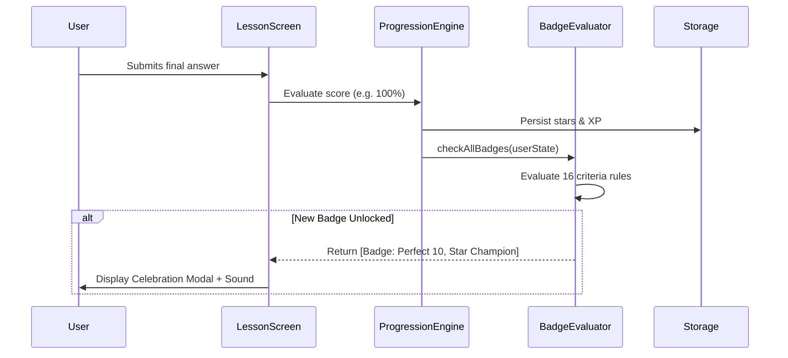

# Detailed Technical Design Document: Learning With Fun (MVP1)

**Project Name**: Learning With Fun  
**Document**: Technical Design & Architecture Specification (TDD)  
**Target Platform**: Mobile (Android SDK 24+, iOS 14+)  
**Framework**: React Native 0.74, Expo SDK 51, TypeScript 5.x, Expo Router v3  
**Backend & Persistence**: Firebase Auth (Anonymous), Cloud Firestore, AsyncStorage (Offline-first)  
**Document Version**: 1.0  
**Status**: Approved for Implementation  

---

## 1. System Overview & Architecture Goals

### 1.1 Architectural Vision
The architecture of **Learning With Fun** is designed around three primary tenets:
1. **Frictionless Kid Experience**: Instant boot time ($<2.5$ seconds), zero account creation barrier (anonymous auth), and fluid 60fps animations on budget mobile hardware.
2. **Offline-First Resilience**: Full gameplay, lesson consumption, quiz evaluation, and badge unlocking work without any active internet connection. Cloud synchronization happens opportunistically in the background.
3. **Modular Domain Logic**: Clear decoupling between the **Learning UI**, **Question Evaluation Engine**, **Progression/Level Ladder**, and **Badge Reward Engine**.

### 1.2 High-Level Architecture Diagram

```mermaid
graph TD
    subgraph UI_Layer [Presentation Layer - React Native / Expo Router]
        RootLayout[app/_layout.tsx - Navigation & Providers]
        Home[app/index.tsx - Subject Hub & Profile Bar]
        SubjectView[app/subject/[subject].tsx - Island Adventure Map]
        LessonView[app/lesson/[lessonId].tsx - Micro-Lesson Player]
        BadgeShelf[app/badges/index.tsx - Trophy & Badge Cabinet]
    end

    subgraph State_Layer [State & Logic Engines]
        Context[LearningContext & Hooks]
        QEngine[QuestionEngine - Answer Validator]
        PEngine[ProgressionEngine - XP, Levels & Stars]
        BEngine[BadgeEvaluator - Achievement Trigger]
    end

    subgraph Data_Layer [Data & Storage Layer]
        StaticCurriculum[(Static Curriculum Data - 50 Lessons)]
        LocalStorage[(AsyncStorage - Local Offline Cache)]
        FirebaseStore[(Firebase Firestore - Cloud Sync)]
        FirebaseAuth[(Firebase Auth - Anonymous Tokens)]
    end

    RootLayout --> Context
    Home --> Context
    SubjectView --> Context
    LessonView --> Context
    BadgeShelf --> Context

    Context --> QEngine
    Context --> PEngine
    Context --> BEngine

    Context --> StaticCurriculum
    Context --> LocalStorage
    LocalStorage <-->|Background Bi-directional Sync| FirebaseStore
    Context --> FirebaseAuth
```

---

## 2. Technology Stack & Key Dependencies

| Component | Technology | Version | Purpose |
|:---|:---|:---|:---|
| **Core Framework** | React Native | 0.74.x | Cross-platform native mobile runtime |
| **Tooling & Build** | Expo SDK | 51.x | Managed workflow, fast iteration, native plugins |
| **Language** | TypeScript | 5.3+ | Strict static typing and code reliability |
| **Navigation** | Expo Router | ~3.5.x | File-based typed routing with deep-link support |
| **Cloud Backend** | Firebase JS SDK | 10.x | Anonymous auth, NoSQL cloud storage |
| **Local Storage** | AsyncStorage | `@react-native-async-storage/async-storage` | Zero-latency offline client cache |
| **Vector Icons** | `@expo/vector-icons` | ^14.0.0 | High-contrast visual icons for kids |
| **Animations** | React Native Reanimated | ~3.10.x | Fluid 60fps celebratory effects & card flips |
| **Sound / Haptics**| Expo Haptics | ~13.0.x | Tactile and audio feedback on interactions |

---

## 3. Directory & File Structure

The project follows a feature-oriented modular design:

```
learnwithfun/
├── app/                              # Expo Router file-based screens
│   ├── _layout.tsx                   # Root navigation shell & Context Providers
│   ├── index.tsx                     # Home portal (Subject selection + XP summary)
│   ├── subject/
│   │   └── [subject].tsx             # Adventure road map for Maths or Science
│   ├── lesson/
│   │   └── [lessonId].tsx            # 4-stage micro-lesson player
│   ├── badges/
│   │   └── index.tsx                 # Trophy cabinet & badge details modal
│   └── profile/
│       └── index.tsx                 # Avatar selection, streak, and reset options
├── src/
│   ├── components/                   # Reusable atomic UI components
│   │   ├── common/
│   │   │   ├── KidButton.tsx         # Oversized tactile button with pop animation
│   │   │   ├── ProgressBar.tsx       # Bubbly progress indicator
│   │   │   ├── StarRating.tsx        # 1-3 animated gold stars
│   │   │   └── LevelBadge.tsx        # Current tier icon + XP display
│   │   ├── lesson/
│   │   │   ├── LearnStage.tsx        # Concept story & illustration
│   │   │   ├── PlayStage.tsx         # Interactive demonstration
│   │   │   ├── EarnStage.tsx         # Quiz question runner
│   │   │   └── CelebrationModal.tsx  # Confetti, stars, and XP summary popup
│   │   └── questions/
│   │       ├── MultipleChoiceCard.tsx
│   │       ├── TrueFalseCard.tsx
│   │       ├── ImageSelectionCard.tsx
│   │       └── DragDropCard.tsx
│   ├── context/
│   │   └── LearningContext.tsx       # Unified React Context for app-wide state
│   ├── data/
│   │   ├── models.ts                 # TypeScript interfaces & types
│   │   ├── mathsCurriculum.ts        # 25 Grade 2 Maths lessons & questions
│   │   ├── scienceCurriculum.ts      # 25 Grade 2 Science lessons & questions
│   │   └── badgesCatalog.ts          # 16 badge definitions with trigger criteria
│   ├── engines/
│   │   ├── questionEngine.ts         # Scoring & answer evaluation
│   │   ├── progressionEngine.ts      # XP, Star, and Level calculation logic
│   │   └── badgeEvaluator.ts         # Rules engine for unlocking badges
│   └── services/
│       ├── storageService.ts         # AsyncStorage offline storage wrapper
│       ├── syncService.ts            # Firestore background synchronization
│       └── firebase.ts               # Firebase app initialization & auth
└── docs/                             # Project planning & architectural specs
    ├── PROJECT_PLAN.md
    └── SYSTEM_DESIGN.md
```

---

## 4. Domain Data Models & TypeScript Specifications

### 4.1 Subject, Module, and Lesson Models

```typescript
export type Subject = 'maths' | 'science';

export interface Module {
  id: string;               // e.g., 'maths-m1', 'science-s2'
  title: string;            // e.g., 'Numbers & Place Value'
  description: string;
  subject: Subject;
  order: number;            // 1 to 5
  icon: string;             // Icon identifier
  requiredStarsToUnlock: number; // e.g., 0 for M1, 10 for M2
}

export interface Lesson {
  id: string;               // e.g., 'maths-m1-l1'
  moduleId: string;
  title: string;
  description: string;
  order: number;            // Global sequential order (1 to 50)
  estimatedDuration: number;// In seconds (typically 180 - 360)
  
  // 4-Stage Pedagogical Content
  learnContent: {
    storyText: string;      // Kid-friendly narrative
    illustrationUrl?: string;
    bulletPoints?: string[];
  };
  playContent: {
    activityTitle: string;
    instructions: string;
    demoExample: string;
  };
  questionIds: string[];    // IDs of questions in this lesson
}
```

### 4.2 Polymorphic Question Engine Models

```typescript
export type QuestionType = 
  | 'multiple_choice' 
  | 'image_selection' 
  | 'true_false' 
  | 'drag_drop';

export type Difficulty = 'easy' | 'medium' | 'hard';

export interface BaseQuestion {
  id: string;
  lessonId: string;
  type: QuestionType;
  difficulty: Difficulty;
  questionText: string;
  explanation: string;      // Shown after answering (educational feedback)
  points: number;           // Standard base points (e.g., 10, 20, 30)
  hint?: string;            // Helpful clue on first mistake
}

export interface MultipleChoiceQuestion extends BaseQuestion {
  type: 'multiple_choice';
  options: Array<{
    id: string;
    text: string;
    icon?: string;
  }>;
  correctOptionId: string;
}

export interface ImageSelectionQuestion extends BaseQuestion {
  type: 'image_selection';
  options: Array<{
    id: string;
    label: string;
    imageUrl: string;
  }>;
  correctOptionId: string;
}

export interface TrueFalseQuestion extends BaseQuestion {
  type: 'true_false';
  correctAnswer: boolean;
}

export interface DragDropQuestion extends BaseQuestion {
  type: 'drag_drop';
  bins: Array<{ id: string; label: string }>;
  items: Array<{ id: string; label: string; correctBinId: string }>;
}

export type Question = 
  | MultipleChoiceQuestion 
  | ImageSelectionQuestion 
  | TrueFalseQuestion 
  | DragDropQuestion;
```

### 4.3 User Progression & Gamification Models

```typescript
export interface UserProgress {
  lessonId: string;
  completed: boolean;
  score: number;            // 0 to 100 percentage
  starsEarned: number;      // 0 to 3
  xpEarned: number;         // Total XP earned on this lesson
  attemptsCount: number;
  lastAttemptedAt: string;  // ISO 8601 string
  bestScore: number;
}

export interface UserProfile {
  userId: string;           // Firebase UID or anonymous device UUID
  nickname: string;         // e.g., 'Speedy Lion'
  avatarId: string;         // 'lion' | 'rocket' | 'robot' | 'star'
  totalXp: number;
  currentLevel: number;     // 1 to 5
  totalStars: number;
  streakDays: number;
  lastActiveDate: string;   // YYYY-MM-DD for streak tracking
}

export interface Badge {
  id: string;               // e.g., 'first_step', 'math_starter'
  title: string;
  description: string;
  iconName: string;
  category: 'milestone' | 'subject_maths' | 'subject_science' | 'mastery' | 'streak';
  unlocked: boolean;
  unlockedAt?: string;
  xpBonus: number;          // Extra XP awarded upon unlock (e.g., 50 XP)
}
```

---

## 5. Core Engine Algorithms & Logic

### 5.1 Progression & Scoring Engine (`progressionEngine.ts`)

#### 1. Star Rating Calculation
```typescript
export function calculateStars(score: number): number {
  if (score >= 90) return 3;
  if (score >= 70) return 2;
  if (score >= 50) return 1;
  return 0; // Encouragement replay mode
}
```

#### 2. XP Distribution Algorithm
```typescript
export function calculateLessonXp(score: number, isFirstCompletion: boolean): number {
  let baseBonus = 0;
  if (score >= 90) baseBonus = 100;
  else if (score >= 70) baseBonus = 75;
  else if (score >= 50) baseBonus = 50;
  else baseBonus = 25; // Participation points

  // First time completing awards 20% milestone bonus
  const multiplier = isFirstCompletion ? 1.2 : 1.0;
  return Math.round(baseBonus * multiplier);
}
```

#### 3. Level Progression Ladder
Total XP determines player level dynamically:

$$\text{Level} = \begin{cases} 
1 & \text{if } 0 \le \text{XP} \le 200 \\
2 & \text{if } 201 \le \text{XP} \le 600 \\
3 & \text{if } 601 \le \text{XP} \le 1200 \\
4 & \text{if } 1201 \le \text{XP} \le 2000 \\
5 & \text{if } \text{XP} \ge 2001 
\end{cases}$$

```typescript
export function calculateUserLevel(totalXp: number): { level: number; title: string; nextLevelXp: number; progressPercent: number } {
  const levels = [
    { level: 1, title: 'Curious Seedling', minXp: 0, maxXp: 200 },
    { level: 2, title: 'Junior Explorer', minXp: 201, maxXp: 600 },
    { level: 3, title: 'Knowledge Adventurer', minXp: 601, maxXp: 1200 },
    { level: 4, title: 'Math & Science Star', minXp: 1201, maxXp: 2000 },
    { level: 5, title: 'Grand Master Whiz', minXp: 2001, maxXp: Infinity },
  ];
  
  const current = levels.find(l => totalXp >= l.minXp && totalXp <= l.maxXp) || levels[0];
  const span = current.maxXp - current.minXp;
  const progressPercent = current.level === 5 ? 100 : Math.min(100, Math.round(((totalXp - current.minXp) / span) * 100));

  return {
    level: current.level,
    title: current.title,
    nextLevelXp: current.maxXp,
    progressPercent,
  };
}
```

#### 4. Module Unlock Gate
A module is unlocked if the learner meets the star requirement:
```typescript
export function isModuleUnlocked(module: Module, totalStarsEarned: number): boolean {
  return totalStarsEarned >= module.requiredStarsToUnlock;
}
```

---

### 5.2 Badge Evaluation Engine (`badgeEvaluator.ts`)

Badges are evaluated automatically after every lesson completion using an event-driven trigger system:



#### Evaluation Criteria Matrix:
- **`first_step`**: `completedLessonsCount >= 1`
- **`math_starter`**: All 5 lessons in Module `maths-m1` completed.
- **`science_starter`**: All 5 lessons in Module `science-s1` completed.
- **`perfect_10`**: Any lesson completed with `score === 100`.
- **`star_collector`**: `totalStars >= 25`.
- **`star_champion`**: `totalStars >= 60`.
- **`super_streak`**: `streakDays >= 3`.
- **`whiz_master`**: `currentLevel === 5`.

---

## 6. Offline-First Storage & Cloud Synchronization Architecture

### 6.1 Two-Tier Storage Architecture

```
User Action ──► In-Memory State (React Context)
                       │
                       ▼ (Sync Write)
             AsyncStorage (Local Disk) ──► Immediate UI Response (0ms delay)
                       │
                       ▼ (Async Queue / Background Sync)
             Cloud Firestore (Remote)  ──► Permanent Backup across devices
```

### 6.2 Firestore Database Schema Design

#### Collection: `users/{userId}`
```json
{
  "nickname": "Leo",
  "avatarId": "lion",
  "totalXp": 450,
  "currentLevel": 2,
  "totalStars": 14,
  "streakDays": 2,
  "lastActiveDate": "2026-09-26",
  "updatedAt": "2026-09-26T17:30:00Z"
}
```

#### Sub-collection: `users/{userId}/progress/{lessonId}`
```json
{
  "lessonId": "maths-m1-l1",
  "completed": true,
  "bestScore": 100,
  "starsEarned": 3,
  "xpEarned": 120,
  "attemptsCount": 1,
  "lastAttemptedAt": "2026-09-26T17:28:00Z"
}
```

#### Sub-collection: `users/{userId}/badges/{badgeId}`
```json
{
  "badgeId": "first_step",
  "unlockedAt": "2026-09-26T17:28:00Z"
}
```

### 6.3 Offline Reconnection & Sync Protocol
1. On application launch, `syncService.ts` checks network connectivity using `@react-native-community/netinfo` (or native fetch ping).
2. If online:
   - Query Firestore for latest timestamps.
   - If remote has newer data (e.g. played on another device), merge state into local cache.
   - Flush any uncommitted local updates to Firestore in a batched write (`writeBatch`).
3. If offline:
   - Mark changes as `pendingSync: true` in local storage. Continue full app functionality without error modals.

---

## 7. Kid-Centric UI/UX Design System

### 7.1 Design Tokens & Color Palette

```
┌─────────────────────────────────────────────────────────────┐
│                 LWF DESIGN PALETTE (KID-FRIENDLY)           │
├────────────────────┬───────────┬────────────────────────────┤
│ Token Name         │ Hex Code  │ Usage                      │
├────────────────────┼───────────┼────────────────────────────┤
│ `--math-primary`   │ `#3B82F6` │ Maths portal, blue cards   │
│ `--math-accent`    │ `#60A5FA` │ Maths progress & badges    │
│ `--sci-primary`    │ `#10B981` │ Science portal, green cards│
│ `--sci-accent`     │ `#34D399` │ Science progress & badges  │
│ `--gold-star`      │ `#F59E0B` │ Stars, XP counters, badges │
│ `--success-green`  │ `#22C55E` │ Correct answer highlight   │
│ `--gentle-orange`  │ `#FB923C` │ "Try Again" card (soft)    │
│ `--neutral-bg`     │ `#F8FAFC` │ Main app background        │
│ `--card-white`     │ `#FFFFFF` │ Question container card    │
│ `--text-title`     │ `#1E293B` │ Oversized readable text    │
│ `--text-body`      │ `#475569` │ Description & instructions │
└────────────────────┴───────────┴────────────────────────────┘
```

### 7.2 Accessibility & Physical Ergonomics for Kids
- **Minimum Tap Size**: All buttons, cards, and options have a bounding box $\ge 52 \times 52\text{ dp}$ with a minimum gap of $12\text{ dp}$ to prevent accidental miss-clicks.
- **Visual Clarity**: Bold typography (font sizes: Titles $24\text{sp}-28\text{sp}$, Subtitles $18\text{sp}-20\text{sp}$, Options $18\text{sp}$).
- **Non-Punitive Feedback**: Incorrect answers never turn the screen harsh red. Instead, the card gently shakes (`Animated.timing`), displays a soft orange highlight, and prompts: *"Almost! Let's try once more!"*

---

## 8. Technical Debt & Codebase Bug Remediation Plan

An analysis of the existing source files revealed key technical defects that will be resolved during implementation:

### 8.1 In `src/context/LearningContext.tsx`
- **Issue 1: Missing Firestore imports**: Functions `collection`, `getDocs`, `deleteDoc` are called in lines 142, 143, 196, 198 without being imported from `firebase/firestore`.
- **Issue 2: Scoping Bug**: Variable `updatedProgress` is declared conditionally inside an inner block (line 408) causing compile-time undefined reference.
- **Resolution**: Refactor persistence logic out of the giant monolithic context file into dedicated modular services (`services/storageService.ts` and `services/syncService.ts`).

### 8.2 In `src/screens/LessonScreen.tsx`
- **Issue 1: Style Prop Typo**: Line 142 references `style.questionsContainer` instead of `styles.questionsContainer`, leading to undefined style runtime exceptions.
- **Issue 2: Array Method on Plain Object**: Line 85 attempts `questionScores.forEach(...)`, but `questionScores` is typed as `Record<number, boolean>` which does not have a `.forEach` method in JavaScript.
- **Resolution**: Use `Object.values(questionScores).filter(Boolean).length` and correct the style name.

---

## 9. Security, Privacy (COPPA), and Compliance

1. **Zero Personally Identifiable Information (PII)**:
   - No name, email, phone number, location, or school details are requested or recorded.
   - Child accounts use auto-generated Firebase Anonymous IDs (e.g. `anon_a81f3b...`).
2. **Ad-Free & Safe Sandbox**:
   - No external WebView links, third-party analytics trackers, or social sharing SDKs.
3. **Firestore Security Rules**:
```javascript
rules_version = '2';
service cloud.firestore {
  match /databases/{database}/documents {
    match /users/{userId} {
      allow read, write: if request.auth != null && request.auth.uid == userId;
      match /{allSubcollections=**} {
        allow read, write: if request.auth != null && request.auth.uid == userId;
      }
    }
  }
}
```

---

## 10. Verification & Test Strategy

| Test Layer | Target | Method |
|:---|:---|:---|
| **Unit Tests** | `progressionEngine.ts` | Verify star calculation thresholds, XP math, and Level transitions. |
| **Unit Tests** | `badgeEvaluator.ts` | Verify that all 16 badges trigger under exact criteria and do not duplicate. |
| **Component Tests** | `MultipleChoiceCard.tsx` | Test touch responsiveness, accessibility labels, and selection states. |
| **Integration Tests**| `LearningContext` | Test flow: Load offline data $\to$ complete lesson $\to$ update state $\to$ trigger sync. |
| **Device Testing** | Android Phones & Tablets | Verify responsive layout across 5-inch phone up to 10-inch tablet screen. |
